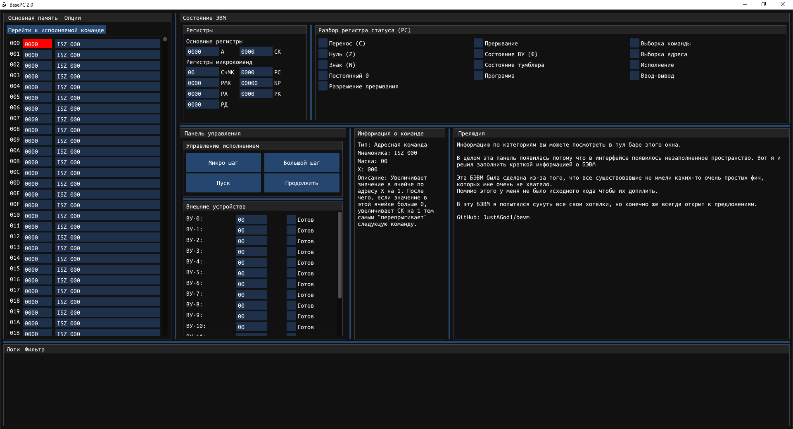
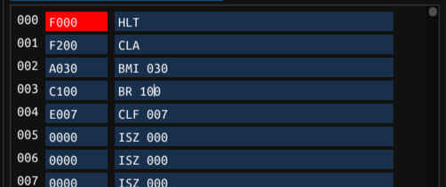
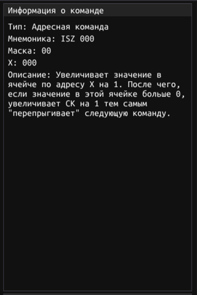
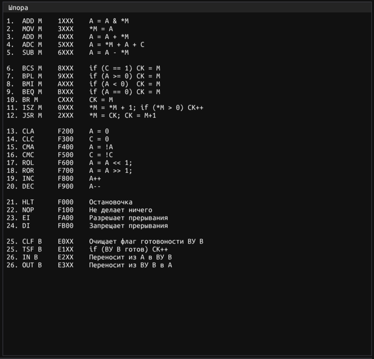
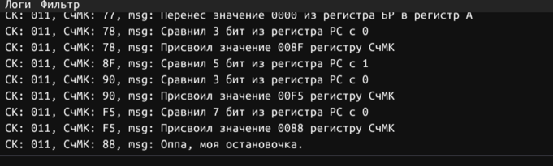

# BasePC 2.0 

Очередной эмулятор БЭВМ сделанный [по вот этой книге](https://books.ifmo.ru/file/pdf/761.pdf)  
Отличается от других реализацией кол-вом полезных фич и близостью к "настоящей" БЭВМ, легковесностью и портированностью под все платформы.

Для приверженцев философии tl;dr. В случае проблем тыкать [сюда](#установка)



## Редактирование мнемоники

В этой реализации БЭВМ можно писать не только хексом, но и мнемоникой напрямую. То есть текстом.



## Поддержка переменных

Имеется поддержка очень простого ASM подобного языка.  
Например:  
```asm
$pos 10
CLA $start
BMI %then
BR %start


$pos 15
ISZ 2 $then
BR %start
```
Если загрузить это в память ЭВМ получится


Подробнее описано во внутренней справке БЭВМ. Кстати...

## Встроенная справка

Все понимают что смотреть в методичку всем лень, потому в этой БЭВМ есть встроенная справка.  
Можно посмотреть на справку по отдельной команде:



Или же на все команды в целом:



В окне со справкой есть еще пару отделов и в дополнение к тому практически все компоненты БЭВМ рисуют попап с краткой информацией о них.

## Лог

В нижней панели БЭВМ вы можете увидеть лог выполняемых командами действий.  



Считаю, очень удобно когда вам нужно понять, что происходит в программе.

## Состояние ЭВМ

В этой БЭВМ нет принципиально ничего неизменяемого. Все флаги, которые работают в "каноничной" БЭВМ работают и в этой. У каждого есть свой эффект и они все хорошо описаны.

Кнопки отладки придерживаются того же принципа, что и пульт отладки "каноничной" БЭВМ, но при этом сохраняют свою интуитивность.

## Установка

### Windows 

1. Скачайте архив
2. Распакуйте полностью
3. В распакованной папке запустите БЭВМ

### MacOS

1. Скачайте образ
2. Откройте образ
3. Переместите BasePC 2.0 в Applications

#### В случае ошибки с недостатком привилегий для запуска

1. Откройте терминал
2. Введите `cd /Applications`. Затем Enter
3. Введите `xattr -rd com.apple.quarantine "BasePC 2.0.app"`. Затем Enter.

Это все нужно потому что, я не хочу платить Apple 99 bucks за сертификат.

### Linux

1. Установите пакет sdl2
2. Запустите программу

Уверен вам линуксоидам больше объяснений не требуется.